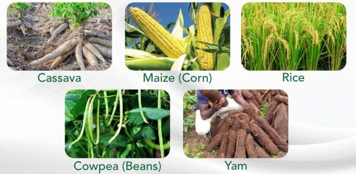

# Prediction of Crop Yield CSC476 Project

Agriculture is a vital sector in Nigeria, contributing significantly to the nation's GDP and providing food security for millions. This project focuses on developing a machine learning-driven system to predict crop yields for key tropical agricultural produce such as maize, rice, cassava, and groundnut, among others. The prediction is based on critical factors like land area under cultivation, annual rainfall, fertilizer, and pesticide use. The goal is to assist farmers, policymakers, and other stakeholders in optimizing crop production by making informed decisions based on data.

**Group 10 Semester Project**

Computer Science 😑😑😑